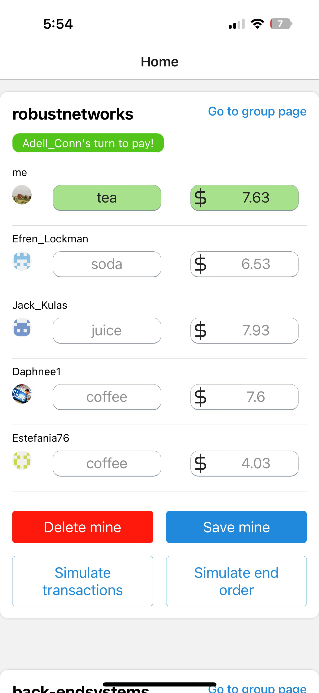
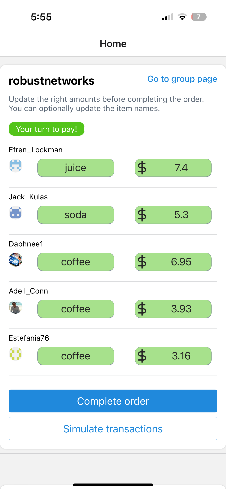
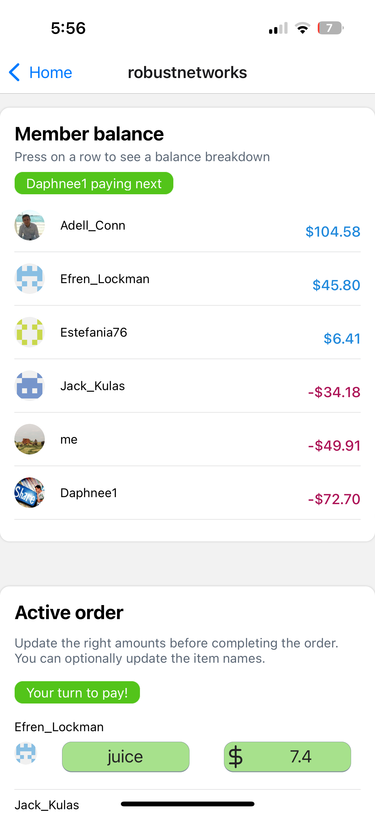
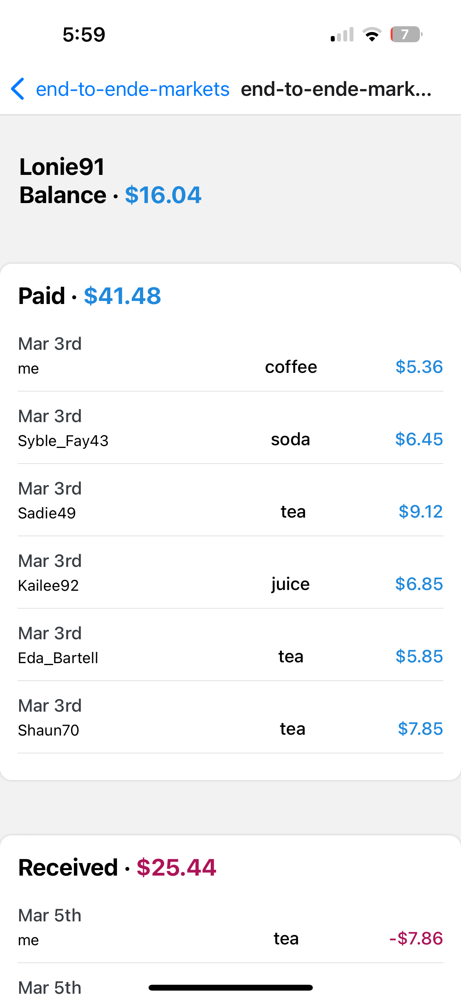
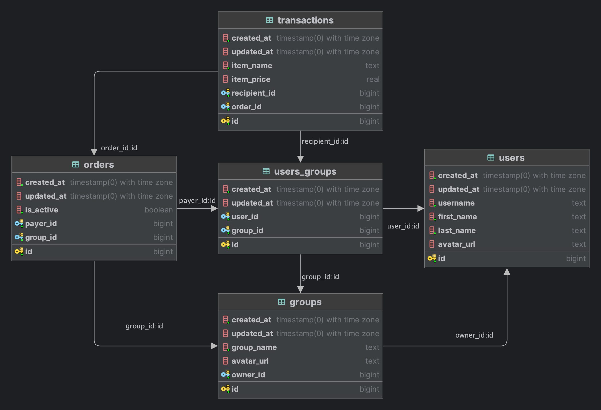

# snackpot

Snackpot is a React Native mobile application that helps your friend or co-worker group decide who should cover the next group expense. How? By making the decision for you. 

# Getting Started

**Development environment requirements**
- Postgres
- node
- Expo Go (mobile app available on App Store / Google Play)

## Clone Repo 
```
git clone https://github.com/vxm5091/snackpot.git
```

## Copy environment files
Run the below command from the root folder: 
```
cp ./server/.env.example ./server/.env && cp ./app/.env.example ./app/.env
```


Open the `app` environment file (`./app/.env`) and change the IP address to your local network. 

### Mac 
`Wifi settings -> Details -> IP address`


## Install dependencies 
```
yarn && cd app && npx expo install && cd ../server/ && yarn
```

## Run database migrations and seeders
```
cd ./server && yarn migration:up && yarn seeder:fresh
```

You can find the seeder logic in `./server/src/seeders/DatabaseSeeder.ts`<br>
The server `.env` file also provides two toggles to generate more or fewer entities. See data model below for an explanation of the data logic. 

## Install Expo Go  
You can download it from the App Store or Google Play. Expo Go will allow you to run the app in development mode directly on your device. 

## Start both servers  
```
yarn start
```
Run this from the root folder to start both development servers. In your terminal, you will see a QR code. This will link you directly to Expo Go. 

## Stack Overview  
Both the frontend and backend are written in **Typescript**.<br>
Frontend: React Native, React Relay, Expo.<br>
Backend: Node.js, NestJS, GraphQL (Relay), MikroORM, Postgres. 


## Demo
Let's review our problem again: we need a system for deciding, in a balanced fashion, whose turn it is next to pick up the group check. 

With each order, **if the user pays, their balance goes up**. If they **receive, their balance goes down.**
**The user with the lowest balance pays for the next order** -> their balance goes back up.


<table>
  <tr>
    <td>
      
      <br>
      <em style="display:block; text-align:center;">Home Screen - user not paying</em>
    </td>
    <td style="padding-left:20px;"> <!-- Add space between images -->
      
      <br>
      <em style="display:block; text-align:center;">Home Screen - user is paying</em>
    </td>
  </tr>
</table>

The Home screen show an active order card for each group the user is in. If there isn't an active order open, the user can start one. The payer will still be chosen based on balance.

The highlighted green fields are the ones the user can edit. When the user is **not paying**, they just have to input what they got. Filling in the price is optional for the receiving user in case the payer is the only one who goes to pick up the order. 

When **the user is paying**, they can edit all the fields and make any adjustments.

**Simulate transactions**
When starting a new order, the user's entry will be the only one. This essentially fills in all the other members' orders with dummy data. **Note**: if all the members already have entries, it won't generate new ones.

**Simulate end order**
In a production flow, only the payer can close out the order. That way, they can make sure the amounts are right. Since we're in test mode, we want to simulate closing the order and starting a new one. 


<table>
  <tr>
    <td>
      
      <br>
      <em style="display:block; text-align:center;">Group Info</em>
    </td>
  </tr>
</table>

Group info provides a deeper dive on group activity, as well as shows every member's latest balance. 


<table>
  <tr>
    <td>
      
      <br>
      <em style="display:block; text-align:center;">Balance breakdown</em>
    </td>
  </tr>
</table>

You can **press on any row in the member balance table** to see a historical breakdown of that user's transactions within the group.  


# Data model 



There isn't much of a first-player mode to this app. It sets out to solve a group problem. As such, `users-groups` is really the focal point of the data model. A user's orders and transactions with other users is in the context of the group. From that perspective, this model more closely resembels Splitwise vs Venmo. 


# Assumptions / MVP shortcuts

1. Ignoring tax. The assumption is that that piece balances out over time and the focus is more so on facilitating the decision making behind whose turn it is.
2. No authentication. For ease of use, the USER_ID is hard coded on the server. 


# TODO / Next step improvements
-  Test more frictionless ways of automating the cost entry portion. After all, who really wants to do expenses on a daily basis?
  - gamification
  - auto complete suggestions based on past transactions 
- Incorporate dataloader on the server side to fix GraphQL N+1 problem 


